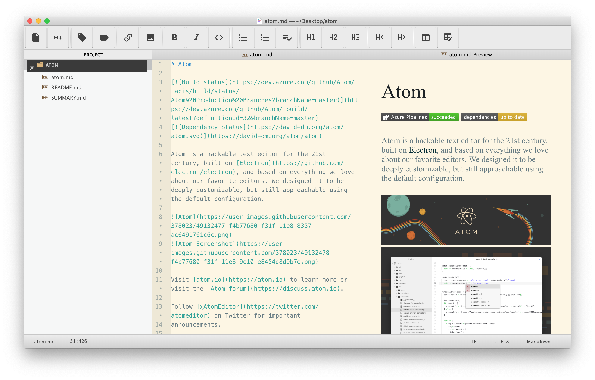

# gitbook-cli+atom再造gitbook editor

在gitbook改版之后，gitbook editor不再更新，新的web版本还砍除了导出pdf的功能，更让Mac用户恶心的是，系统升级后，老版本的editor也无法使用，目前也没发现一款现成免费的替代品，因此曲线救国，使用`atom`替代editor编辑器，使用老版本的`gitbook-cli`导出pdf或者其他格式

## atom

### 下载

进入[atom官网](https://atom.io)进行下载，或者在[github上](https://github.com/atom/atom/releases)进行下载

### 插件

• Atom File Icons 改变icon

• Markdown Preview Plus 预览

• Markdown Table Editor 表格

• Tool Bar Markdown Writer 快捷工具栏



经过一些简单的配置后，效果如上图所示，左侧为文件目录，中间是编辑区域，右侧是预览效果，顶部是常用工具栏

### gitbook-cli

[gitbook-cli 2.3.2](https://www.npmjs.com/package/gitbook-cli)
[gitbook 2.6.9](https://www.npmjs.com/package/gitbook)

• calibre 格式转换依赖ebook-convert
[calibre下载页面](https://calibre-ebook.com/download)

选择历史版本，3.40.0—3.48.0均可，以下是3.46.0版本下载链接

[calibre 3.46.0](https://download.calibre-ebook.com/3.46.0/)

• 安装nvm node version manager

```zsh
# 安装nvm
brew install nvm
# 通过nvm安装早期版本的node
nvm install v5.6.0
# 使用早期版本
nvm use v5.6.0
# 全局安装gitbook-cli
npm install -g gitbook-cli
# gitbook测试
gitbook -V
```

• 可能错误

```
xcrun: error: invalid active developer path (/Library/Developer/CommandLineTools), missing xcrun at: /Library/Developer/CommandLineTools/usr/bin/xcrun
```


```zsh
xcode-select --install
```

```zsh
# gitbook最新稳定版是3.2.3，
# 如果升级了或者单独安装了，
# 就默认使用gitbook3.2.3(或其他版本)导致错误
# 运行这个命令导致单独安装gitbook
npm install -g gitbook
# 运行这个命令会升级gitbook(小版本升级)
gitbook update
# 所以不要运行以上两个命令，否则，需要按以下步骤解决
# 查看已经安装了的版本
gitbook ls
# 如果有2.6.9，删除其他版本，如3.2.3
gitbook uninstall 3.2.3
# 否则安装2.6.9，再删除其他版本
gitbook fetch 2.6.9
```

```zsh
# gitbook版本
➜  ~ gitbook ls-remote
Available GitBook Versions:

     4.0.0-alpha.6, 4.0.0-alpha.5, 4.0.0-alpha.4, 4.0.0-alpha.3, 4.0.0-alpha.2, 4.0.0-alpha.1, 3.2.3, 3.2.2, 3.2.1, 3.2.0, 3.2.0-pre.1, 3.2.0-pre.0, 3.1.1, 3.1.0, 3.0.3, 3.0.2, 3.0.1, 3.0.0, 3.0.0-pre.15, 3.0.0-pre.14, 3.0.0-pre.13, 3.0.0-pre.12, 3.0.0-pre.11, 3.0.0-pre.10, 3.0.0-pre.9, 3.0.0-pre.8, 3.0.0-pre.7, 3.0.0-pre.6, 3.0.0-pre.5, 3.0.0-pre.4, 3.0.0-pre.3, 3.0.0-pre.2, 3.0.0-pre.1, 2.6.9, 2.6.8, 2.6.7, 2.6.6, 2.6.5, 2.6.4, 2.6.3, 2.6.2, 2.6.1, 2.6.0, 2.5.2, 2.5.1, 2.5.0, 2.5.0-beta.7, 2.5.0-beta.6, 2.5.0-beta.5, 2.5.0-beta.4, 2.5.0-beta.3, 2.5.0-beta.2, 2.5.0-beta.1, 2.4.3, 2.4.2, 2.4.1, 2.4.0, 2.3.3, 2.3.2, 2.3.1, 2.3.0, 2.2.0, 2.1.0, 2.0.4, 2.0.3, 2.0.2, 2.0.1, 2.0.0, 2.0.0-beta.5, 2.0.0-beta.4, 2.0.0-beta.3, 2.0.0-beta.2, 2.0.0-beta.1, 2.0.0-alpha.9, 2.0.0-alpha.8, 2.0.0-alpha.7, 2.0.0-alpha.6, 2.0.0-alpha.5, 2.0.0-alpha.4, 2.0.0-alpha.3, 2.0.0-alpha.2, 2.0.0-alpha.1

Tags:

     latest : 2.6.9
     pre : 4.0.0-alpha.6
```

### 命令使用

```zsh
# 进入项目文件夹atom
cd atom
# 初始化gitbook项目
gitbook init .
# 指定gitbook版本初始化gitbook项目
gitbook init . --gitbook=2.6.9
# 导出pdf
gitbook pdf . xxx.pdf
# 指定gitbook版本导出pdf
gitbook pdf . xxx.pdf --gitbook=2.6.9
```

### book.json

使用`gitbook-cli`初始化后只生成了`README.md`和`SUMMRY.md`文件，在导出时需要通过`book.json`文件指定信息，以下提供一个模板，需要自己创建

```json
{
	"gitbook": "2.x",
	"title": "ECMAScript 6入门",
	"description": "<ECMAScript 6入门>PDF版",
	"author":"阮一峰",
	"language": "zh-hans",
	"structure": {
		"readme": "README.md"
	},
	"plugins": [
		"katex",
		"-search"
	]
}
```

### 写在最后

`gitbook editor`是基于`nw`进行的GUI开发，使用时编辑文档操作过快容易卡顿，甚至导致电脑假死，在使用该替代方案后，完美解决了以上缺陷

因为gitbook-cli是两年前的项目，所以node和npm要使用当时对应的版本，即npm的版本3.6.0，node的版本5.6.0，同理calibre也要使用3.46.0版本
